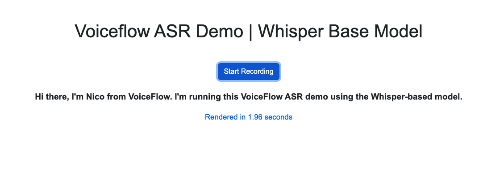

# Voiceflow ASR Demo | Whisper Base Model

This project is a test page to demonstrate Automatic Speech Recognition (ASR) using OpenAI's Whisper model running locally. It consists of a simple webpage that captures audio from the user's microphone, sends it to a custom endpoint, and displays the transcribed text and the time it took to render the transcription.




## Features

- Start and stop recording with a button
- Auto-end recording after a specified duration of silence
- Utilizes a Docker container to run the ASR webservice locally
- Uses a proxy to avoid CORS issues

## Prerequisites

- Node.js
- Docker

## Installation and Setup

1. Clone this repository:

```bash
git clone https://github.com/voiceflow-gallagan/whisper-asr-demo.git
```

2. Change to the project directory:

```bash
cd whisper-asr-demo
```

3. Install the required dependencies:

```bash
npm install
```

4. Pull and run the Docker container for the ASR webservice:
Do not hesitate to check the [openai-whisper-asr-webservice](https://github.com/ahmetoner/whisper-asr-webservice.git) repo for more details and/or to load a different model.

```bash
docker run -d -p 9000:9000 -e ASR_MODEL=base.en onerahmet/openai-whisper-asr-webservice:latest
```

5. Start the proxy server:

```bash
npm start
```

The proxy server should now be running at http://localhost:3000.
This is needed to avoid CORS issues when making requests to the ASR webservice while running the demo locally.

6. Open the `index.html` file in your browser to use the ASR demo.

## Usage

1. Click the "Start Recording" button to start capturing audio from your microphone.
2. Speak into the microphone, and the application will automatically transcribe your speech.
3. The recording will stop automatically after a specified duration of silence, or you can manually stop it by clicking the "Stop Recording" button.
4. The transcribed text and the time it took to render the transcription will be displayed on the page.

## Info

You can set the duration of silence after which the recording will stop by changing the `silenceDuration` variable in the `app.js` file.
You can change the endpoint that the demo will send the audio to by changing the `whisperEndpoint` variable in the `app.js` file.
If you change the endpoint, you will also need to change the `target` variable in the `proxy.js` file.

## Next steps

You can host and run the custom ASR webservice on your own server and use it in your next Voiceflow Voice Assistant integration.
