# Voiceflow Discord

### Use Voiceflow Dialog Manager API to run a Discord Bot

# Prerequisite

- [Replit](https://www.replit.com/) account
- [Discord App](https://discord.com/developers/applications)
- [Voiceflow](https://www.voiceflow.com/) **Chat Assistant** project

# Setup


### Create your Discord App

Go to to [https://discord.com/developers/applications](https://discord.com/developers/applications) to create your Discord app


Name your application and click “**Create**”

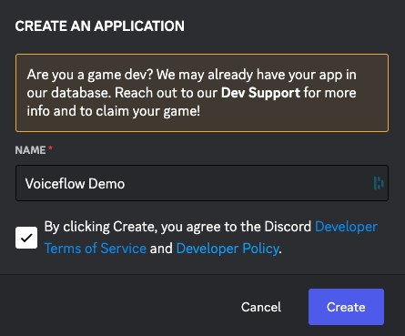

From the General Information tab, copy the **APPLICATION ID** and **save it for later**


On the Bot tab, generate a Token by clicking on **Reset Token** button

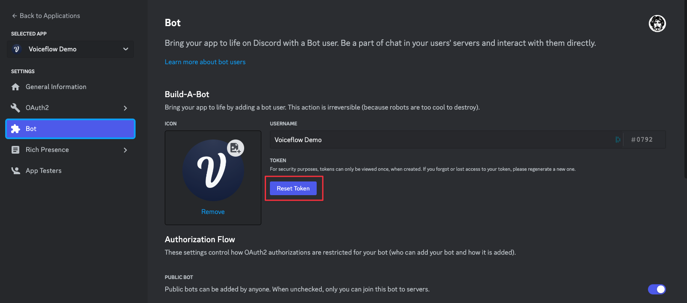

Copy the newly created token and **save it for later**

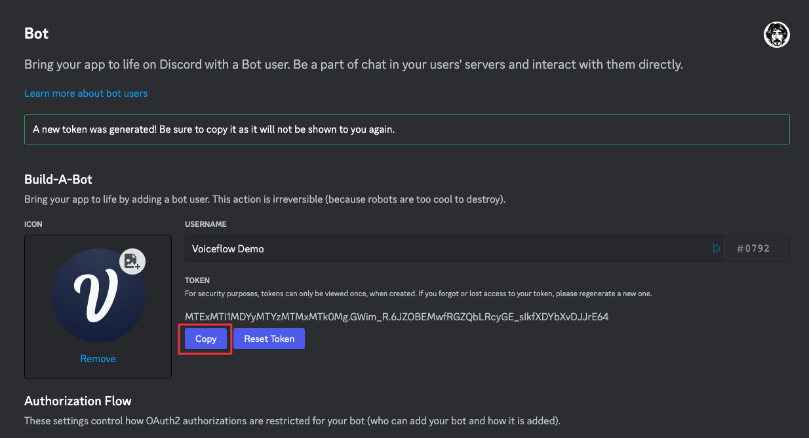

Scroll down and toggle **PRESENCE INTENT**, **SERVER MEMBERS INTENT** and **MESSAGE CONTENT INTENT**. Do not forget to save your changes.

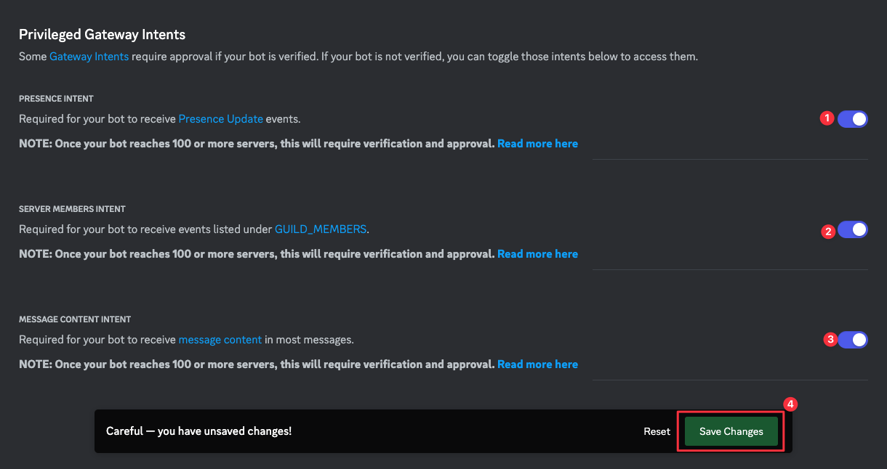

Now, on the OAuth2 tab, select bot for the **SCOPES** and give the **BOT PERMISSIONS** you need.

Once it’s done, click the **Copy** button at the bottom of the page.

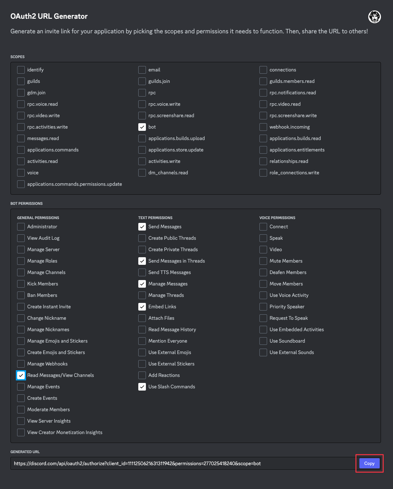


Open this link in a new tab and add the bot to **your Discord server**

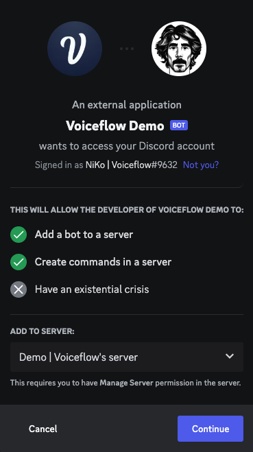

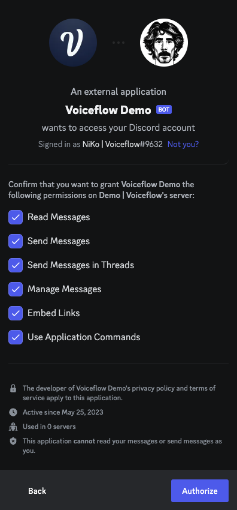

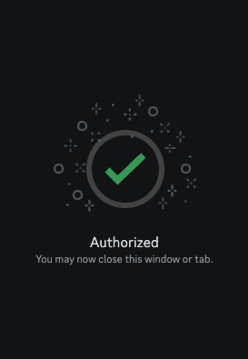

On your Discord server you should now see the bot in the Users tab and a new message

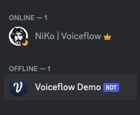

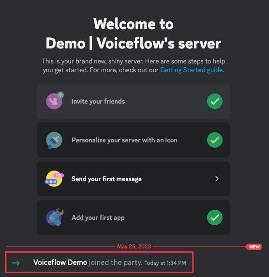

If you haven’t activated the Developer Mode already, do it by going to the settings: **APP SETTINGS** > **Advanced**

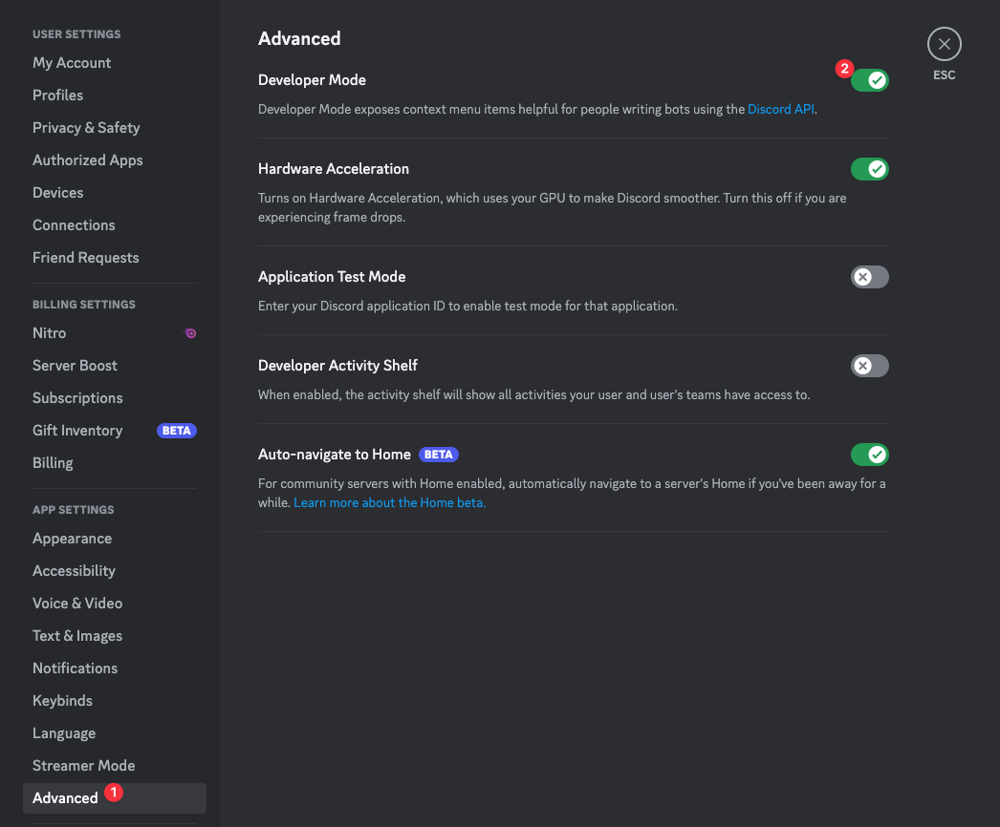

**Right click** on your server icon in the left sidebar, click on **Copy Server ID** and **save it for later**.

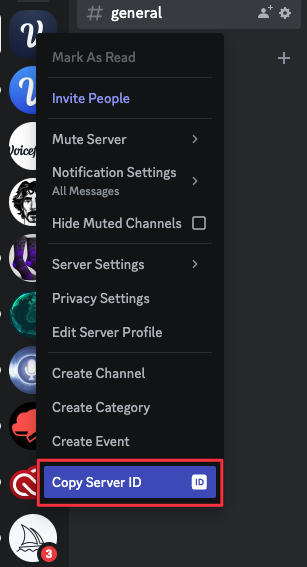

> You should now have:
an <mark>app key</mark>
a <mark>bot token</mark>
a <mark>server id</mark>
>


### Get your project Dialog API key

Go to **Voiceflow Creator** and open the Chat Assistant project you want to use.
Click on **Integration** from the left sidebar (or press the 6 key)


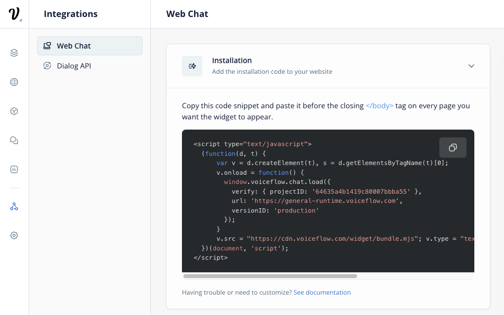

Select the **Dialog API** integration, click **Copy API Key** to copy your Voiceflow Dialog API Key and **save it for later**


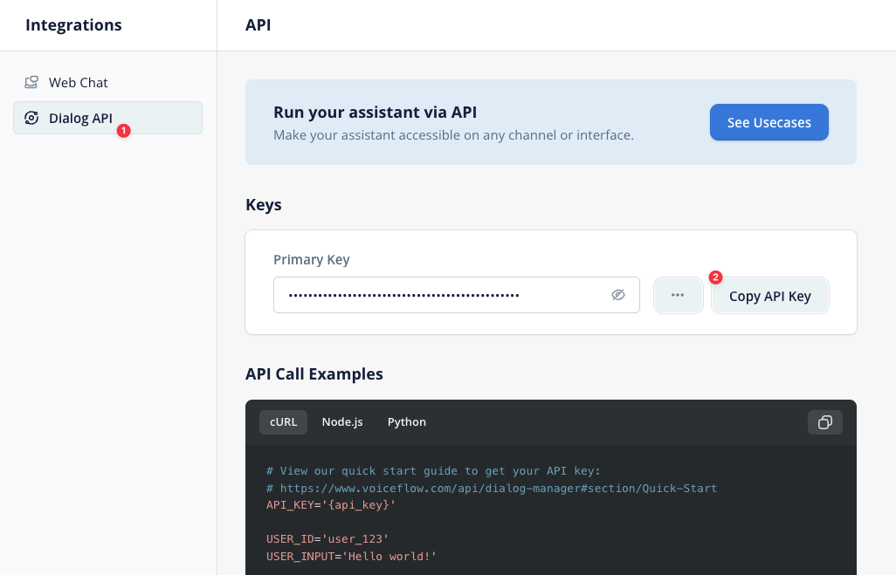

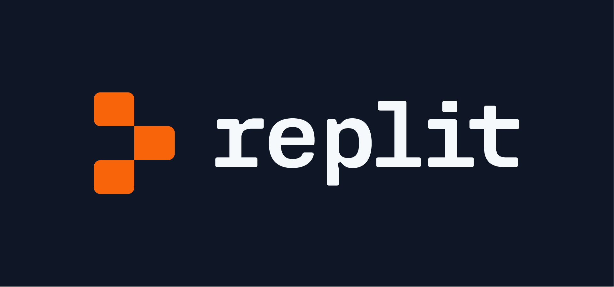

[Fork on Replit](https://replit.com/@niko-voiceflow/voiceflow-discord?v=1)

### Setup the Replit secrets

Set new Secrets with the following info


**DISCORD_TOKEN**
Discord bot token

**APP_ID**
Discord App ID

**SERVER_ID**
Discord server ID

**VOICEFLOW_API_URL**
Voiceflow Dialog API endpoint (default to general runtime)

**VOICEFLOW_API_KEY**
Voiceflow project API key (from the Integration section)

**VOICEFLOW_VERSION_ID**
Voiceflow project version ID (only for transcripts, default to 'production')

**VOICEFLOW_PROJECT_ID**
Voiceflow project ID (only for transcripts, default to null)

On the **Secrets tab**, you can click the **Edit as JSON** button and paste the following JSON (do not forget to update the keys values):

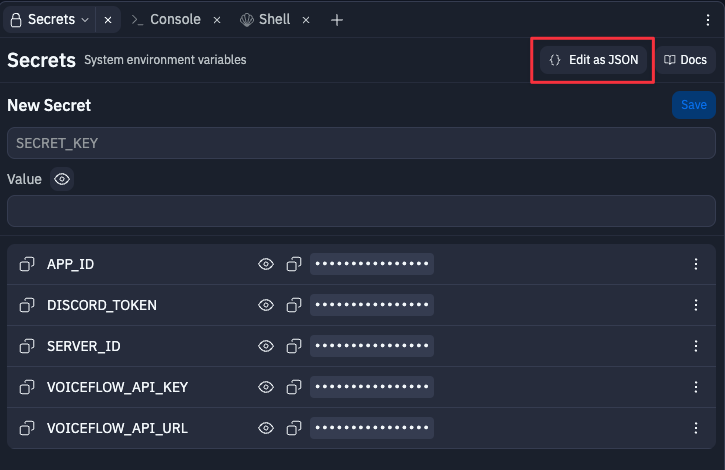

```
{
  "DISCORD_TOKEN": "XXX",
  "APP_ID": "XXX",
  "SERVER_ID": "XXX",
  "VOICEFLOW_API_URL": "https://general-runtime.voiceflow.com",
  "VOICEFLOW_API_KEY": "VF.DM.XXX",
  "VOICEFLOW_VERSION_ID": "XXX",
  "VOICEFLOW_PROJECT_ID": "XXX"
}

```

### Run your app on Replit

Once forked and updated with the Secrets, run your app and check the Console


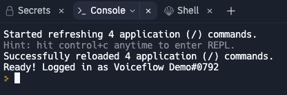

## Video

If you are a bit curious and want to dive in the code, we’ve made a video to go over the Node JS app and the different ways to interact with the Discord bot.

[https://www.loom.com/share/58af327708104dfaaec6ffb11d62b271](https://www.loom.com/share/58af327708104dfaaec6ffb11d62b271)
