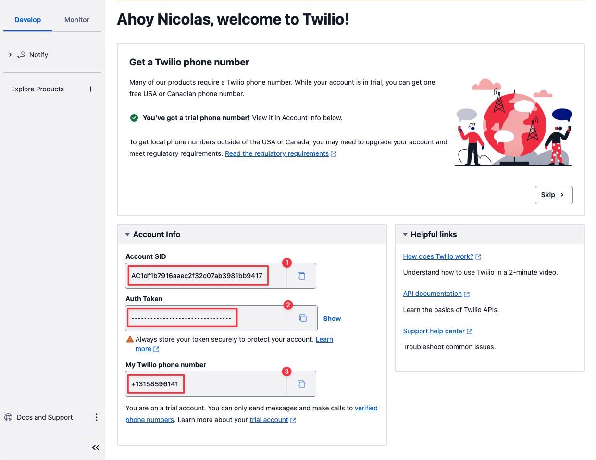
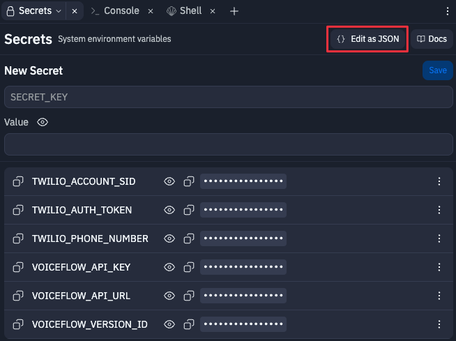
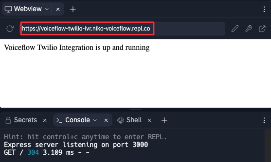
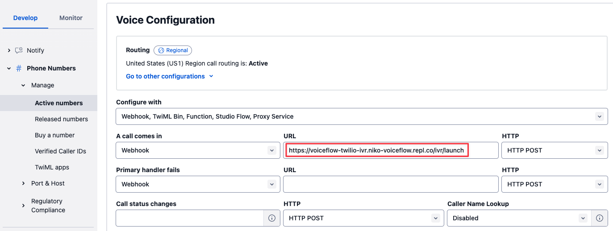

# Twilio IVR Integration README

### Use Voiceflow Dialog Manager API to run a Twilio IVR

VR stands for Interactive Voice Response. It is a technology that enables a computer system to interact with callers through voice and DTMF (Dual-Tone Multi-Frequency) keypad inputs. IVR systems are widely used for automating telephony services, allowing customers to access information or navigate through menus without the need for a human operator.

With this integration you will be able to run your Voiceflow Assistant with Twilio Voice service.
The main feature covered in the code are:

- Interaction with Voiceflow Dialog API
- SMS (Send an SMS to the user using {user_id})
- Call (HandOff)

# Prerequisite

- [Twilio](https://console.twilio.com) account
- [Voiceflow](https://www.voiceflow.com/) **Assistant** project
- [Replit](https://replit.com) account (not required if you run the code locally)

# Setup on Twilio


### Create your Twilio account

Go to to [https://console.twilio.com](https://console.twilio.com) to create your account
You will be granted with a **trial** you can use for this demo

If you haven’t done already or if you’ve just created your account you will need to get a **Twilio phone number**. On the console page, click on **Get a Twilio phone number** button.


When done, you will need to copy and save for later your **Account SID**, your **Auth Token** and your **Twilio phone number**.



> You should now have:
an <mark>Account SID</mark>
an <mark>Auth Token</mark>
a <mark>Twilio phone number</mark>
>

# Setup on Voiceflow


### Get your project Dialog API key

Go to Voiceflow Creator and open the Assistant project you want to use.

On your Assistant, click on **Integration** from the left sidebar (or press the 6 key)


Click **Copy API Key** to copy your Voiceflow Dialog API Key and save it for later.


If you want to save **Transcripts**, you will also need your Assistant **version ID**.
You can find it in your Assistant settings:


> You should now have:
an <mark>API Key</mark>
a <mark>Version ID</mark>
>

# Setup on replit


Start by forking the project form this link: [Fork on Replit](https://replit.com/@niko-voiceflow/voiceflow-twilio-ivr?v=1)

[https://replit.com/@niko-voiceflow/voiceflow-twilio-ivr?v=1](https://replit.com/@niko-voiceflow/voiceflow-twilio-ivr?v=1)

### Setup the Replit secrets

> Set new Secrets with the following info
>

**TWILIO_ACCOUNT_SID**

Your Twilio Account SID

**TWILIO_AUTH_TOKEN**

Your Twilio Auth Token

**TWILIO_PHONE_NUMBER**

Your Twilio phone number

**VOICEFLOW_API_URL**
Voiceflow Dialog API endpoint (default to general runtime)

**VOICEFLOW_API_KEY**
Voiceflow project API key (from the Integration section)

**VOICEFLOW_VERSION_ID**
Voiceflow project version ID (only for transcripts, default to 'production')

**VOICEFLOW_PROJECT_ID**
Voiceflow project ID (only for transcripts, default to null)

In the **Secrets tab**, you can click on Edit as JSON button and paste the following JSON (do not forget to update the keys values):



```
{
	"TWILIO_ACCOUNT_SID": "XXX",
	"TWILIO_AUTH_TOKEN": "XXX",
	"TWILIO_PHONE_NUMBER": "+13158596141",
	"VOICEFLOW_API_URL": "https://general-runtime.voiceflow.com",
	"VOICEFLOW_API_KEY": "VF.DM.XXX",
	"VOICEFLOW_VERSION_ID": "XXX",
	"VOICEFLOW_PROJECT_ID": "XXX"
}

```

### Run your app on Replit

Once forked and updated with the Secrets, run your app and check the Console


The **Webview tab** should be visible with a confirmation telling you that the integration is running.
You need to **copy the URL of your endpoint** to setup your webhook in Twilio.



### Update your Webhook on Twilio

Back on Twilio, in the **Phone Numbers service** > **Active numbers**, paste your repl endpoint in the webhook URL field and add the **/ivr/launch** path to it.

As an example, mine looks like this:

```bash
https://voiceflow-twilio-ivr.niko-voiceflow.repl.co/ivr/launch
```



Do not forget to **save** your configuration


## Testing

You’re now ready!
Simply call your **Twilio number** and start interacting with your Assistant.

## Video

We’ve also made a video to explain how to created, setup and use the Custom Action steps in your Assistant to handle DTMF, make a call or send an SMS.

SOON
